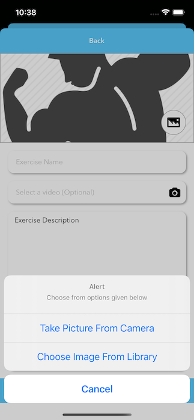

## Introduction

Hi, Humans!

My name is Hamza Farooq and I love 'Swift' programming. I always try to implement new ideas. Do check [Swift-TopViewController](https://github.com/hamza-faroooq/Swift-TopViewController) and [Swift-NativeActionSheetManager](https://github.com/hamza-faroooq/Swift-NativeActionSheetManager) for this Picker to work properly and if you do not want to use these additional things, you can remove them from the [NativeImageVideoPickerManager](https://github.com/hamza-faroooq/Swift-NativeImageVideoPickerManager/blob/main/ImagePickerManager.swift) on your on.

# Swift-NativeImageVideoPickerManager
This class is used to make native image and video picker in a single use

### Images



## Simple Usage

Do the following simple steps to add this Manager class in your project

First of all, follow the instructions written in **Introduction** section of this documentaion

Then, simply download or copy [this](https://github.com/hamza-faroooq/Swift-NativeImageVideoPickerManager/blob/main/ImagePickerManager.swift) code and place it in your project. (Click on the link, this will take you to the directory where NativeImageVideoPickerManager is placed)

## Example

### For Image

First set the delegate to *self* as mentioned below

```swift

ImagePickerManager.sharedInstance.imagePickerSelectedDelegate = self

```

Then simply call this function

```swift

ImagePickerManager.callGenericImagePickerActionSheet(presentingController: self, title: "Actions", message: "Add a photo to your gallary", buttonTitlesArray: ["Take Picture", "Choose From Library"])
        
```

This will automatically handle the permissions and all the stuff that you need to write again and again. After this write the [Protocol](https://docs.swift.org/swift-book/LanguageGuide/Protocols.html) to handle the response of the PickerManager

```swift

extension YourViewController: imagePickerSelectedProtocol, UIImagePickerControllerDelegate {
    
    func imagePickerSelectedFunction(selectedImage: UIImage?) {
        
        let mySelectedImage = selectedImage
        
        // do your stuff here
        
    }

}

```

### For Video

Set the delegate for the video

```swift

ImagePickerManager.sharedInstance.videoPickerSelectedDelegate = self

```

Then call the function

```swift

ImagePickerManager.callGenericImagePickerActionSheet(presentingController: self, title: ALERT, message: "Choose from options given below", buttonTitlesArray: ["Take Video From Camera", "Choose Video From Library"], isVideo: true)

```

Then use the protocol to handle the response

```swift

extension YourViewController: videoPickerSelectedProtocol, UIImagePickerControllerDelegate {
        
    func videoPickerSelectedFunction(selectedVideo: NSURL?) {
        
        if let selectedVid = selectedVideo {
            
            // do your stuff here

        }
        
    }
    
}

```

There are several attributes that you can modify to change the behaviour of the video picker. In the manager class there is a limit of maximum length for the video, current limit is 30 seconds. The manager also uses the compression for the video, if you do not want to compress the video then you can modify the manager on your own.

## Permissions

Last but not the least, don't forget to add the following permissions in info.plist file of your project.

```swift

<key>NSCameraUsageDescription</key>
<string>Grant access so that you can capture photo as profile image easily</string>

<key>NSPhotoLibraryUsageDescription</key>
<string>Grant access so that you can upload your photo as profile image easily</string>

```
        
### I uses this class for my own personal use, if you want to use some other methods or want to modify this class on your own, you can. :-)

## Contributions

Your contributions are most welcomed. Do let me know if you find any kind of issue while using this file. Please open an issue to discuss that problem. Thanks

## Auther

Hamza Farooq, hamza_faroooq@yahoo.com

## License

[MIT](https://github.com/hamza-faroooq/Swift-NativeImageVideoPickerManager/blob/main/LICENSE) (Click Me O_o)
